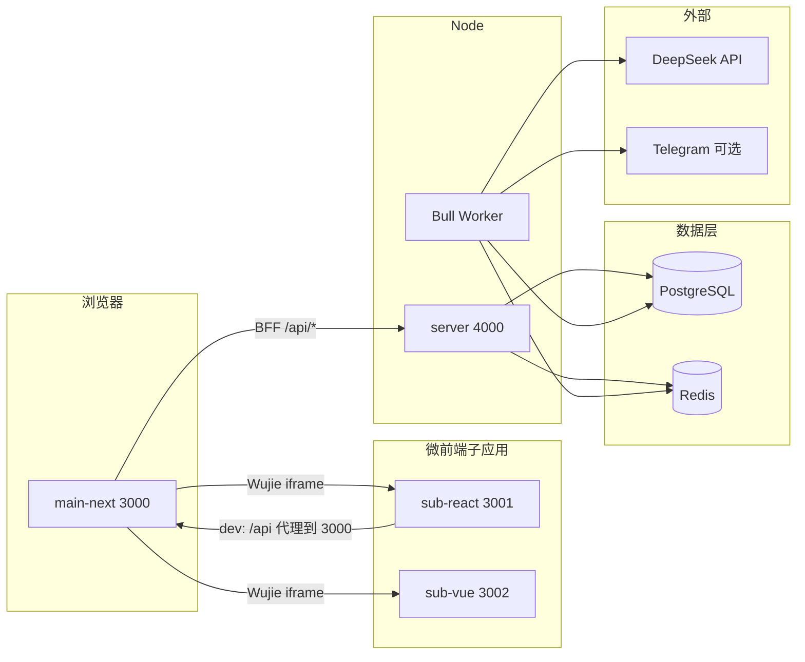

# Sentinel 架构说明

本文档补充根目录 [README.md](../README.md) 中的产品背景与运维细节，从**运行时拓扑**与**请求路径**角度归纳各包职责，便于新成员与二次开发时快速对齐。

---

## 1. 运行时拓扑

- **唯一 BFF**：浏览器与子应用调用的受保护 HTTP API 以 **`apps/main-next/app/api`** 为入口，再代理到 **`apps/server`** 的 `NODE_SERVICE`（默认 `http://127.0.0.1:4000/api/v1`）。
- **Express**：在 `/api/v1` 下提供扫描任务、聊天流、用户设置等；**生产环境**可对 HTTP 层使用 **Node cluster**（见 `apps/server/src/bootstrap.ts`），与 **Bull Worker** 同进程启动于每个 worker。
- **子应用**：`sub-react` 开发模式下将 `/api` 代理到主站，便于携带 Cookie；`sub-vue` 以链上只读（viem）为主，仍通过 Wujie 接收宿主注入的 Web3 状态。

---

## 2. 认证与跨域

| 层级 | 职责 |
|------|------|
| **Next `proxy.ts`** | 以 **accessToken + refreshToken** 双 Cookie 判定页面会话；对 `/api` 按 `lib/subAppOrigins.ts` 做 **CORS + credentials**。 |
| **Next `app/api/auth/*`** | 会话、续签（如 `auth/refresh`）、与钱包登录相关的 Server Actions（见 `actions/auth.ts`）。 |
| **Express `authMiddleware`** | 受保护路由需 **同时** 有效的 Access 与 Refresh，且 **`sub` 一致**（见 `apps/server/src/middlewares/auth.ts`）。 |

子应用请求 BFF 时应使用宿主注入的 **`bffOrigin`**（与当前主域一致），避免写死端口。

---

## 3. 异步扫描与实时日志

- 扫描任务入 **Bull** 队列；处理逻辑在 **`apps/server/src/workers/scanner.ts`**（多阶段 DeepSeek：Scanner → Auditor → Decision）。
- Worker 通过 **Redis Pub/Sub** 向频道 `job:{jobId}:log` 推送结构化日志；前端经 BFF 的 SSE/轮询（如 `scan/stream`）展示进度。
- 链上授权数据由 **`@sentinel/security-sdk`**（viem）批量拉取；若无有效授权，Worker 可跳过 LLM 调用以节省成本。

---

## 4. 共享包职责

| 包 | 说明 |
|----|------|
| `@sentinel/database` | Prisma schema、客户端导出、Redis 封装。 |
| `@sentinel/auth` | Nonce、**DualJwtService**、与双 Token 相关的校验工具。 |
| `@sentinel/security-sdk` | ERC20 allowance 审计与链上常量。 |
| `@repo/ui` | 共享 UI 组件。 |
| `@repo/eslint-config` / `@repo/typescript-config` | 工作区 Lint 与 TS 基线。 |

---

## 5. Express API 一览（`/api/v1`，均需双 JWT）

前缀在 `apps/server/src/routes`：

| 方法 | 路径 | 用途 |
|------|------|------|
| GET | `/scan/latest` | 最近任务 |
| GET | `/scan/stream` | 审计日志流 |
| GET | `/scan/:jobId` | 任务状态 |
| POST | `/scan` | 发起扫描 |
| POST | `/scan/revoked` | 标记已撤销授权 |
| GET | `/chat/stream` | 对话流 |
| GET | `/chat/messages` | 历史消息 |
| POST | `/chat/session` | 创建会话 |
| GET/PATCH | `/user/telegram-chat-id` | Telegram 告警绑定 |

健康检查：`GET /api/v1` 返回服务元数据（**登录与 Cookie 写入在 Next，不在此列表中**）。

---

## 6. 子应用代码布局（摘要）

| 应用 | 核心目录 | 说明 |
|------|-----------|------|
| **sub-react** | `views/AuditDashboard`、`components/audit`、`api/`、`utils/bffOrigin.ts` | 审计面板；BFF 调用与聊天历史合并。 |
| **sub-vue** | `stores/`、`services/monitorChainService.ts`、`components/monitor`、`views/MonitorDashboard` | 监控面板；Pinia + ECharts + viem。 |

---

## 7. 相关文档

- 根目录 [README.md](../README.md)：功能、环境变量、Docker、Caddy、**main-next standalone 发布**。
- [apps/main-next/README.md](../apps/main-next/README.md)：BFF、Wujie、`build:release`。
- [apps/server/README.md](../apps/server/README.md)：Server 专用环境变量与本地命令。
