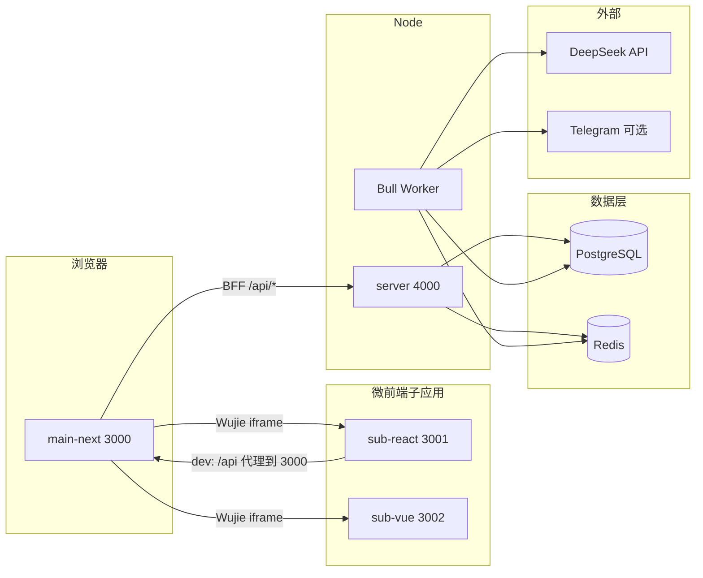

# Sentinel 架构说明

本文档补充根目录 [README.md](../README.md) 中的产品背景与运维细节，从**运行时拓扑**与**请求路径**角度归纳各包职责，便于新成员与二次开发时快速对齐。

**编码规范、目录分层、客户端导入限制、Vitest（含覆盖率）、Knip 与 Playwright**：见 [docs/DEVELOPMENT.md](./DEVELOPMENT.md)。

---

## 1. 运行时拓扑



- **唯一 BFF**：浏览器与子应用调用的受保护 HTTP API 以 **`apps/main-next/src/app/api`** 为入口，再代理到 **`apps/server`** 的 `NODE_SERVICE`（默认 `http://127.0.0.1:4000/api/v1`）。
- **只读/页面级 DTO 聚合**（多路数据合并、去噪、统一字段名）**优先在 `apps/server` 的单一受保护端点**内完成，由 Prisma/Service 做批量查询或受控的 `Promise.all`；BFF 保持 **鉴权 + 转发**（可薄封装 `NextResponse`）。**跨多个 Express 调用的 “事务” 不能靠 BFF 串联 HTTP 实现**；需要 ACID 时，把多写合并进 **同一 service，使用 Prisma 事务**。
- **Express**：在 `/api/v1` 下提供扫描任务、聊天流、用户设置等；**生产环境**可对 HTTP 层使用 **Node cluster**（见 `apps/server/src/bootstrap.ts`），与 **Bull Worker** 同进程启动于每个 worker。
- **子应用**：`sub-react` 开发模式下将 `/api` 代理到主站，便于携带 Cookie；`sub-vue` 以链上只读（viem）为主，仍通过 Wujie 接收宿主注入的 Web3 状态。

---

## 2. 认证与跨域

| 层级 | 职责 |
|------|------|
| **Next `src/proxy.ts`** | 以 **accessToken + refreshToken** 双 Cookie 判定页面会话；对 `/api` 按 `apps/main-next/src/wujie/subAppOrigins.ts` 做 **CORS + credentials**（逻辑在 `src/proxy/runProxy.ts`）。 |
| **Next `src/app/api/auth/*`** | 会话、续签（如 `auth/refresh`）、与钱包登录相关的 Server Actions（见 `src/app/actions/auth.ts`）。 |
| **Express `authMiddleware`** | 受保护路由需 **同时** 有效的 Access 与 Refresh，且 **`sub` 一致**（见 `apps/server/src/middlewares/auth.ts`）。 |

子应用请求 BFF 时应使用宿主注入的 **`bffOrigin`**（与当前主域一致），避免写死端口。

---

## 3. 异步扫描与实时日志

- 扫描任务入 **Bull** 队列；处理逻辑在 **`apps/server/src/workers/scanner.ts`**（多阶段 DeepSeek：Scanner → Auditor → Decision）。
- Worker 通过 **Redis Pub/Sub** 向频道 `job:{jobId}:log` 推送结构化日志；前端经 BFF 的 SSE/轮询（如 `scan/stream`）展示进度。
- 链上授权数据由 **`@sentinel/security-sdk`**（viem）批量拉取；若无有效授权，Worker 可跳过 LLM 调用以节省成本。

---

## 4. 共享包职责

| 包 | 说明 |
|----|------|
| `@sentinel/database` | Prisma schema、客户端导出、Redis 封装。 |
| `@sentinel/auth` | Nonce、**DualJwtService**、与双 Token 相关的校验工具。 |
| `@sentinel/security-sdk` | ERC20 allowance 审计与链上常量。 |
| `@repo/ui` | 共享 UI 组件。 |
| `@repo/eslint-config` / `@repo/typescript-config` | 工作区 Lint 与 TS 基线。 |

---

## 5. Express API 一览（`/api/v1`，均需双 JWT）

前缀在 `apps/server/src/routes`：

| 方法 | 路径 | 用途 |
|------|------|------|
| GET | `/scan/latest` | 最近任务（无任务时 404；仍保留，供仅需 latest 的调用方） |
| GET | `/scan/context` | 审计页**只读聚合**：`latest`（可为 `null`）+ `telegramChatId`，避免前端/BFF 多次编排 |
| GET | `/scan/stream` | 审计日志流 |
| GET | `/scan/:jobId` | 任务状态 |
| POST | `/scan` | 发起扫描 |
| POST | `/scan/revoked` | 标记已撤销授权 |
| GET | `/chat/stream` | 对话流 |
| GET | `/chat/messages` | 历史消息 |
| POST | `/chat/session` | 创建会话 |
| GET/PATCH | `/user/telegram-chat-id` | Telegram 告警绑定 |

健康检查：`GET /api/v1` 返回服务元数据（**登录与 Cookie 写入在 Next，不在此列表中**）。

---

## 6. 子应用代码布局（摘要）

| 应用 | 核心目录 | 说明 |
|------|-----------|------|
| **sub-react** | `views/AuditDashboard`、`App/index.tsx`（路由 + `Suspense`）、`constants/wujieAuditBus.ts`、`App/WujieAuditPathSync.tsx` | 审计面板；**react-router** 子路由；Wujie bus 与主站 `/audit/**` 同步。 |
| **sub-vue** | `views/MonitorDashboard`、`router/index.ts`、`utils/wujie-vue-path-sync.ts`、`constants/wujieMonitorBus.ts` | 监控面板；**vue-router** 子路由；同上同步至 `/monitor/**`。 |

---

## 7. Wujie 子应用路由与主站 App Router 协同

本节说明：**浏览器地址栏**使用主站路径（如 `/audit/wujie-sub-route-test`、`/monitor/wujie-sub-route-test`），与 **iframe 内子应用**（Vite SPA，`react-router` / `vue-router`）如何保持一致，以及为何采用当前实现而不是仅依赖 Wujie 自带的「路由同步」。

### 7.1 目标与约束

| 目标 | 说明 |
|------|------|
| **路径形态** | 主站使用 **可读 path**（`/audit/...`、`/monitor/...`），而不是默认的 `?子应用name=encodeURIComponent(子路径)` 查询串形态。 |
| **保活 `alive`** | 子应用实例不销毁；无界文档指出保活下 **仅改 Wujie 的 `url` prop 往往无法切换子应用内路由**，需配合 **bus 通信** 驱动子应用路由器。 |
| **首屏深链** | 直接打开 `/audit/xxx` 时，iframe 首次加载的入口 URL 需能落到对应子路径（Vite history fallback 到 `index.html`）。 |
| **避免骨架屏闪烁** | 切换子路由时 **不要**让承载 Wujie 的 React 树无意义重挂载，否则 `WujieClient` 内 `isLoaded` 会重置，**审计/监控骨架**会再盖一层。 |

### 7.2 为何不默认开启 Wujie `sync`

无界 `sync: true` 时，子应用 `path + query + hash` 会编码进 **主应用 URL 的查询参数**（key 为子应用的 `name`）。这与 Next.js App Router 下我们希望展示的 **`/audit/**`、`/monitor/**` 纯路径**不一致，且与主站自有路由状态难以统一维护。

因此本仓库对 **审计 / 监控** 两个嵌入页采用 **`sync={false}`**，改由 **Next 路由 + Wujie bus** 自行同步。

### 7.3 总体数据流（双向）

```text
主站 pathname（Next）
    │  hostPathToReactSubPath / hostPathToVueSubPath
    ▼
子路径（子应用 router 的 path，如 /、/wujie-sub-route-test）
    │  bus.$emit('react-sub-navigate' | 'vue-sub-navigate', subPath)
    ▼
子应用：navigate(subPath)

子应用：route 变化
    │  bus.$emit('audit-react-sync-host' | 'monitor-vue-sync-host', { path })
    ▼
主站：router.push('/audit' + path 或 '/monitor' + path)
```

事件名在 **单一数据源** 中定义，子应用与主站必须一致：

| 子应用 | 主站 → 子（宿主推子路由） | 子 → 主站（子应用推主路由） | 主站路径前缀 |
|--------|---------------------------|------------------------------|--------------|
| **sub-react** | `react-sub-navigate`（`apps/main-next/src/wujie/wujieAuditBus.ts` ↔ `apps/sub-react/src/constants/wujieAuditBus.ts`） | `audit-react-sync-host` | `/audit` |
| **sub-vue** | `vue-sub-navigate`（`apps/main-next/src/wujie/wujieMonitorBus.ts` ↔ `apps/sub-vue/src/constants/wujieMonitorBus.ts`） | `monitor-vue-sync-host` | `/monitor` |

### 7.4 主站侧实现要点

1. **可选 catch-all 页面**  
   - `apps/main-next/src/app/(dashboard)/audit/[[...slug]]/page.tsx`  
   - `apps/main-next/src/app/(dashboard)/monitor/[[...slug]]/page.tsx`  
   二者仅 `return null`，用于让 **`/audit`、`/audit/*` 与 `/monitor`、`/monitor/*`** 落在同一套路由下。

2. **持久布局（避免骨架闪烁）**  
   - `apps/main-next/src/app/(dashboard)/audit/layout.tsx` → 挂载 **`AuditReactHost`**  
   - `apps/main-next/src/app/(dashboard)/monitor/layout.tsx` → 挂载 **`MonitorVueHost`**  
   **Layout 在同级子路径之间切换不会卸载**，避免 `WujieClient` 因 page 重挂载而重置加载态。若把 Host 写在 `[[...slug]]/page.tsx` 里，slug 变化会导致 **page 重挂载**，从而再次出现骨架屏。

3. **Host 组件**（`AuditReactHost.tsx`、`MonitorVueHost.tsx`）  
   - **`useState` 初始化一次 `wujieEntryUrl`**：仅 **第一次进入** 该 layout 时，按当前主站路径拼好 iframe 入口（支持深链首屏）；之后在应用内切换子路由 **不再改 Wujie 的 `url` prop**，减少 iframe 无意义重载。  
   - **`sync={false}`**（见 7.2）。  
   - **`subPath` 变化**时 `setTimeout(0)` 后 **`bus.$emit(..., subPath)`**，驱动子应用 `navigate`。  
   - 监听 **`audit-react-sync-host` / `monitor-vue-sync-host`**，将 `{ path }` 映射为 **`/audit...` / `/monitor...`** 后 `router.push`。

4. **路径解析工具**  
   - `src/wujie/wujieAuditBus.ts`：`hostPathToReactSubPath`、`reactSubPathToIframeHref`  
   - `src/wujie/wujieMonitorBus.ts`：`hostPathToVueSubPath`、`vueSubPathToIframeHref`  

### 7.5 sub-react 侧要点

- **路由**：`react-router-dom`（`BrowserRouter`、`Routes`、`Route`）。  
- **代码分割**：页面级 **`React.lazy` + `Suspense`**（`src/App/index.tsx`）。  
- **桥接**：`src/App/WujieAuditPathSync.tsx` 监听 `react-sub-navigate`、在 `location.pathname` 变化时发出 `audit-react-sync-host`。  
- **测试页**：`/wujie-sub-route-test` → `views/WujieSubRouteTest`；未匹配路由 → `App/NoSubRouteMatch.tsx`。  
- **审计首页**：`App/AuditHome.tsx` 挂载原 `useAppData` + `AuditDashboard`，避免测试页拉起完整 audit 数据流。

### 7.6 sub-vue 侧要点

- **路由**：`vue-router`（`createWebHistory`），懒加载 `import()`（`src/router/index.ts`）。  
- **根组件**：`App/index.tsx` 使用 **`Suspense` + `RouterView`**；`onMounted` 中调用 **`initWujieVuePathSync(router)`**（`src/utils/wujie-vue-path-sync.ts`）。  
- **桥接**：在 bus 上 `$on('vue-sub-navigate')`；`router.afterEach` 中 `$emit('monitor-vue-sync-host', { path: to.path })`。若挂载瞬间尚无 `window.$wujie.bus`，会 **延迟 100ms 再尝试** 一次。  
- **视图**：`views/MonitorHome`（原监控壳 + 测试链接）、`views/WujieSubRouteTest`、`views/NoSubRouteMatch`。

### 7.7 本地验证 URL

| 场景 | URL 示例 |
|------|-----------|
| 审计子应用 + 子路由测试 | `http://localhost:3000/audit/wujie-sub-route-test`（子应用单独：`http://localhost:3001/wujie-sub-route-test`） |
| 监控子应用 + 子路由测试 | `http://localhost:3000/monitor/wujie-sub-route-test`（子应用单独：`http://localhost:3002/wujie-sub-route-test`） |

新增子路由时：在子应用 router 增加 `Route` / `routes` 条目，主站 **`/audit/...` 或 `/monitor/...`** 会自动把后缀交给子应用；未声明的子路径由子应用 **NoSubRouteMatch** 承接。

---

## 8. 相关文档

- 根目录 [README.md](../README.md)：功能、环境变量、Docker、Caddy、**main-next standalone 发布**。
- [apps/main-next/README.md](../apps/main-next/README.md)：BFF、Wujie、`build:release`、**主子路由协同（摘要）**。
- [apps/server/README.md](../apps/server/README.md)：Server 专用环境变量与本地命令。
- [apps/sub-react/README.md](../apps/sub-react/README.md)、[apps/sub-vue/README.md](../apps/sub-vue/README.md)：子应用 README 中的路由与 bus 说明。
